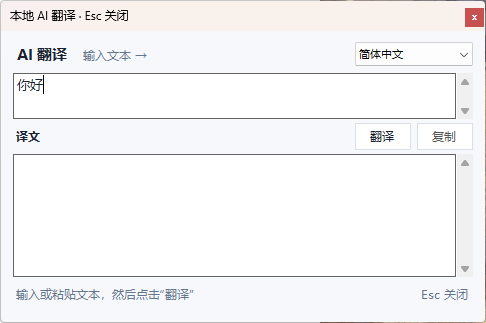

# TranslationByLocalAI

一款 Windows 本地 AI 即时翻译工具。它通过 `llama.cpp` 在本机运行 GGUF
模型，翻译文本不会发送到云端。



## 主要功能

- 在浏览器、记事本、Word、WhatsApp、Electron 和 WinUI 应用中划词后显示翻译入口。
- 点击桌面悬浮入口，可直接输入或粘贴文本。
- 停止输入约 600 毫秒后自动翻译，无需点击“翻译”按钮。
- 继续输入时取消旧请求，避免旧结果覆盖新文本。
- 自动判断中外文方向，也可手动选择 11 种目标语言。
- 自动启动和关闭本机 `llama-server`，支持在设置中切换 GGUF 模型。
- 划选时不读取或改写剪贴板；只有点击翻译按钮后，才会复制选区。
- 点击翻译按钮后，选中文字会保留在剪贴板中，不会再被程序恢复成旧内容。

## 发布版包含的模型

| 模型 | 格式 | 文件大小 | 适合场景 |
| --- | --- | ---: | --- |
| MiniCPM5-1B | F16 | 2.02 GiB | 默认模型；轻量、本地翻译和日常助手 |
| Qwen3-1.7B | Q8_0 | 1.71 GiB | 速度与质量较均衡 |
| Qwen3-4B | Q4_K_M | 2.33 GiB | 更高翻译质量，需要更多内存/显存 |

GitHub 要求单个 Release 附件小于 2 GiB，所以 MiniCPM5-1B 和 Qwen3-4B
以两个 llama.cpp GGUF 分片发布。下载同一模型的全部分片并放在 `Models`
文件夹中，软件选择 `00001` 分片即可自动加载整套模型。

模型来源、许可和使用限制见 [MODEL-LICENSES.md](MODEL-LICENSES.md)。

## 安装发布版

1. 从 [Releases](https://github.com/Leonard-china/TranslationByLocalAI/releases)
   下载 `TranslationByLocalAI-v1.0.1-win-x64-cuda.zip`。
2. 解压到普通文件夹，不要直接在 ZIP 中运行。
3. 下载所需模型的所有 GGUF 附件，放入解压目录内的 `Models` 文件夹。
4. 双击 `TranslationByLocalAI.exe`。
5. 首次启动会加载模型，通常需要数秒至数十秒。

发布版默认使用 MiniCPM5-1B。右键托盘图标并打开“设置”，可切换到另外两个
模型。推荐 Windows 10/11 x64、.NET Framework 4.8 和支持 CUDA 12 的
NVIDIA 显卡；也可回退到 CPU，但速度会明显降低。

## 使用方法

- 即时输入翻译：点击桌面右侧悬浮入口，然后直接输入或粘贴文字。
- 划词翻译：在其他应用中选中文字，点击光标旁出现的翻译按钮。
- `Esc`：关闭翻译窗口。
- 托盘菜单：启用/暂停划词监听、显示桌面入口、测试本地 AI、修改设置或退出。

配置保存在：

```text
%APPDATA%\TranslationByLocalAI\settings.json
```

## 从源码构建

需要 Windows 与 .NET Framework 4.8。项目不依赖 Node.js、Electron 或
额外的 Python 包。

```powershell
powershell.exe -NoProfile -ExecutionPolicy Bypass -File .\build.ps1
```

构建产物位于 `dist\TranslationByLocalAI.exe`。

制作 GitHub 发布附件：

```powershell
powershell.exe -NoProfile -ExecutionPolicy Bypass -File .\package-release.ps1
```

脚本会构建便携版、切分超过 GitHub 限制的 GGUF 文件，并生成 SHA-256
校验清单。模型和 llama.cpp 目录可通过脚本参数覆盖。

## 隐私与限制

- 翻译请求只发送到设置中的 API 地址；默认地址是 `127.0.0.1`。
- 仅做划选动作不会读取选区或模拟 `Ctrl+C`，不应影响其他软件的复制粘贴。
- 密码框、禁止复制的控件、受保护的 PDF/网页可能无法读取选中文本。
- 对以管理员权限运行的程序划词时，本工具通常也需要相同权限。
- 模型可能产生错误内容；重要信息请人工核验。

## 第三方项目

- [llama.cpp](https://github.com/ggml-org/llama.cpp)
- [MiniCPM5-1B](https://huggingface.co/openbmb/MiniCPM5-1B)
- [Qwen3-1.7B](https://huggingface.co/Qwen/Qwen3-1.7B)
- [Qwen3-4B](https://huggingface.co/Qwen/Qwen3-4B)
